# Uniform Build Guide
- [Parts and Preparation](#parts-and-preparation)
  - [PCB](#pcb)
  - [Plate](#plate)
  - [Case](#case)
  - [Keyboard Components](#keyboard-components)
  - [Tools](#tools)
- [Assembly](#assembly)
  - [PCB Assembly](#pcb-assembly)
    - [Main Components](#main-components)
    - [Diodes](#diodes)
    - [Hot-Swap Sockets](#hot-swap-sockets)
  - [Switch and Plate](#switch-and-plate)
  - [Case Assembly and Mounting](#case-assembly-and-mounting)
- [Flashing Firmware](#flashing-firmware)

---
# Parts and Preparation
Before beginning assembly, it's a good idea to have a plan for each required component. The following subsections will explore these components in greater detail. **Here's a top-level rundown of everything you'll need to source yourself**, including hyperlinks to the corresponding subsections below.

- The [Uniform PCB](#pcb)
- All [Required PCB Components](#required-pcb-components)
- Any [Optional PCB Components](#optional-pcb-components)
- A [Plate](#plate), if desired (*strongly recommended*)
- A [Case](#case) (your choice may necessitate addititonal materials and tools)
- **(68x)** Switches of your choice
- **(11x)** 1.5u keycaps
- **(57x)** 1u keycaps
- A USB-C cable
- All required [Tools](#tools)

---
## PCB
**[Download the Uniform PCB gerber files here](https://github.com/patrickhirsh/Uniform-Keyboard/tree/main/PCB/Uniform/GBR)**

I don't sell or distribute PCBs myself, so you'll need to order your own through the PCB manufacturer of your choice. I usually use [JLPCB](https://jlcpcb.com/), but you may want to shop around to find the supplier that gets you the best deal. Most manufacturers will ask you to upload gerber files. In the case of JLPCB, you can simply upload the **UniformGBR.zip** file, which contains all the zipped gerbers.

Uniform makes use of components that are generally widely available to make ordering components as easy as possible. The links provided are for the distributors I've personally sourced parts from, however these components may not always be in stock. Components like capacitors, resistors, and diodes can easily be substituted for virtually any identical variant from another manufacturer and will generally fit in their through-hole footprints on the PCB. Components with specific footprints like the MCU, Logic Level Shifter, Status LEDs, USB-C Connector, and Power / Reset Switches *require the exact component* to fit correctly on the PCB.

### Required PCB Components
| Component | Mfr. # | Quantity | Est. Price |
|-|-|-|-|
|MCU|[STM32L072KZT6](https://www.mouser.com/ProductDetail/STMicroelectronics/STM32L072KZT6?qs=mwoc%252BQmZlGJ4eN3sEity4A%3D%3D)|1|$7.65|
|Voltage Regulator|[TLV1117-33IDCYG3](https://www.digikey.com/en/products/detail/texas-instruments/TLV1117-33IDCYG3/1677131)|1|$0.89|
|Logic Level Shifter|[SN74AHCT1G125DBVR](https://www.mouser.com/ProductDetail/595-SNAHCT1G125DBVR)|1|$0.40|
|Diodes|[1N4148](https://www.mouser.com/ProductDetail/512-1N4148)|68|$5.64|
|NeoPixel Status Led|[5mm Through-Hole 5 Pack](https://www.mouser.com/ProductDetail/YAGEO/MFR-25FRF52-330R?qs=oAGoVhmvjhxv5KjCXy24Qg%3D%3D)|1|$4.95|
|USB-C Connector|[USB4085-GF-A](https://www.digikey.com/en/products/detail/gct/USB4085-GF-A/9859662)|1|$0.94|
|Power / Reset Switch|[OS102011MS2QN1](https://www.digikey.com/en/products/detail/c-k/OS102011MS2QN1/411602)|2|$1.18|
|10µF Capacitor|[FG16X7R1E106KRT06](https://www.digikey.com/en/products/detail/tdk-corporation/FG16X7R1E106KRT06/5802770)|2|$1.34|
|1µF Capacitor|[RDER71H105K2M1H03A](https://www.digikey.com/en/products/detail/murata-electronics/RDER71H105K2M1H03A/4771301)|1|$0.59|
|0.1µF Capacitor|[A104K15X7RF5TAA](https://www.digikey.com/en/products/detail/vishay-beyschlag-draloric-bc-components/A104K15X7RF5TAA/146011)|3|$0.75|
|10 kOhm Resistor|[CFR16J10K](https://www.digikey.com/en/products/detail/te-connectivity-passive-product/CFR16J10K/3317912)|2|$0.20|
|5.1 kOhm Resistor|[RNMF14FTC5K10](https://www.digikey.com/en/products/detail/stackpole-electronics-inc/RNMF14FTC5K10/2617363)|2|$0.20|
|330 Ohm Resistor|[MFR-25FRF52-330R](https://www.mouser.com/ProductDetail/YAGEO/MFR-25FRF52-330R?qs=oAGoVhmvjhxv5KjCXy24Qg%3D%3D)|1|$0.10|
||||**$24.40**|

### Optional PCB Components
| Component | Mfr. # | Quantity | Est. Price | Note |
|-|-|-|-|-|
|Hot-Swap Sockets|[7305-0-15-15-47-27-10-0](https://www.digikey.com/en/products/detail/mill-max-manufacturing-corp/7305-0-15-15-47-27-10-0/1765737)|136|$47.16| other [Mill-Max Options](https://divinikey.com/products/mill-max-hotswap-sockets) or [Kailh](https://divinikey.com/products/kailh-hot-swap-sockets) are good alternatives |
|SWD Header|[826629-5](https://www.digikey.com/en/products/detail/te-connectivity-amp-connectors/826629-5/2276109)|1|$0.71|MCU debug pinout header for debugging and easier flashing|
|330 Ohm Resistor|[MFR-25FRF52-330R](https://www.mouser.com/ProductDetail/YAGEO/MFR-25FRF52-330R?qs=oAGoVhmvjhxv5KjCXy24Qg%3D%3D)|1|$0.10|Necessary if the on-board external LED header will be used|
||||**$47.97**||

---
## Plate
**[Download the Uniform plate .svg file here](https://github.com/patrickhirsh/Uniform-Keyboard/blob/main/Ref/uniform_plate.svg)**

There are many options for having plates cut and shipped to you. I've personally used [Ponoko](https://www.ponoko.com/) and have been happy with their quality. Popular plate materials are aluminum and brass, however I've also found acrylic to look and feel quite nice. The thickness of the plate is determined by the type of switches you intend to use. Most switches (including MX style switches) fit best with a **1.5mm-1.6mm** thick plate.

**Note:** the plate does *not* include holes drilled for mount screw access through the plate. This is because adding mount holes into the plate template results in cuts far too dense for most laser cutting services. If mount screw access through the plate is important to you, the best option is to drill the holes yourself after receiving the plates. Be mindful of the plate material chosen if this is your plan. I've found Aluminium to be quite easy to drill through, but materials like acrylic to be far too brittle to drill into without cracking or shattering.

---
## Case
Uniform does not have its own case (yet!). 

### TOFU65
To get this project off the ground, the Uniform board was designed to fit into a [TOFU65](https://kbdfans.com/collections/tofu65). The USB-C Port lines up with the case cutout and the PCB dimmensions match those of other compatible TOFU65 PCBs. The only caveat us that the PCB mount holes *do not* line up with those in the TOFU65. This is a limitation of the ortholinear layout Uniform utilizes - the mount points overlap with switch positions on Uniform's board, making it impossible to accomodate them. This means you will need to come up with your own mounting solution if you'd like to build this keyboard in a TOFU65 case. 

I've personally done this for the first three prototypes of this board (I ❤️ the TOFU) by dremeling off the original standoffs and 3D printing my own using [M2.5 heatset inserts](https://www.amazon.com/gp/product/B08GWKW1K7/ref=ppx_yo_dt_b_search_asin_title?ie=UTF8&psc=1) and [M2.5 screws](https://www.amazon.com/gp/product/B09WJ4WF9K/ref=ppx_yo_dt_b_search_asin_title?ie=UTF8&psc=1). The 3D printed parts are literally just cylinders with widened bases in which I've heatset the threaded inserts. I used double-sided foam tape

The mounting holes provided on the PCB fit **M2.5** screws.

The PCB is designed to fit into a [TOFU65](https://kbdfans.com/collections/tofu65), however the mounting holes *do not line up* due to the ortholiner positioning of the keys blocking the TOFU's original standoffs. I've personally had success removing the original standoffs on the TOFU with a dremel, 3D printing some standoffs with heatset 2.5M inserts, then fixing the attached standoffs to the case with doublesided foam tape so the PCB can be mounted to them. The USB-C port position *does* align on the TOFU65.

Alternatively, [M2.5 standoffs](https://www.amazon.com/gp/product/B01L06CUJG/ref=ppx_yo_dt_b_search_asin_title?ie=UTF8&psc=1) can be had for cheap, and can be used to prop the PCB up off the desk for an exposed-PCB look. I've typed many *many* hours with Uniform keyboard prototypes set up this way.

---
## Keyboard Components
Uniform has an unconventional layout, which means a special set of keycaps is required. 

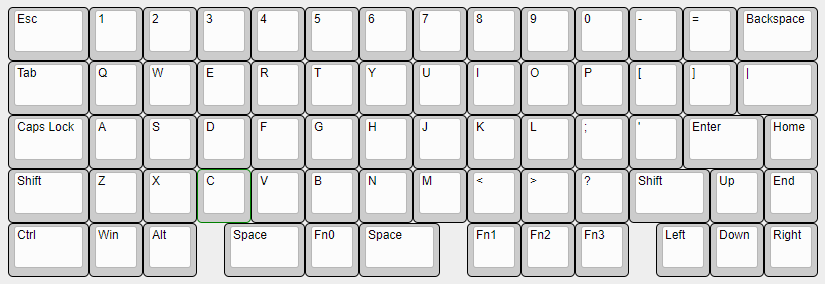

**This layout requires:**
- **(68)** total switches
- **(11)** 1.5u keycaps
- **(57)** 1u keycaps

I find DSA and XDA keycap profiles to be easiest to work with. Many sellers on [Aliexpress](https://www.aliexpress.com/) can make custom batches of 1u and 1.5u blank keycaps, which makes it easier to build a complete keycap set. I like using blanks for all my keys, so I typically put in a single order for all the 1u and 1.5u keycaps from the same distributor so I can guarantee a perfect color match.

Finally, **Don't forget to order a USB-C Cable!**

## Tools
|Tool|Purpose|Necessity|
|-|-|-|
| Soldering Iron & Solder | Soldering components onto the PCB | Required |
| Small Phillips Head Screwdriver | Case assembly and mount screws | Required |
| Tweasers | Hold small components in place while soldering | Recommended |
| Soldering Wick | Desoldering - fixing mistakes and removing excess solder | Recommended |
| Flux Paste | Help solder flow better for surface mount components | Recommended |
| Tape | keep odd-shaped components in place while soldering the first pin  | Recommended |

---

# Assembly
- [PCB Assembly](#pcb-assembly)
  - [Main Components](#main-components)
  - [Diodes](#diodes)
  - [Hot-Swap Sockets](#hot-swap-sockets)
- [Switch and Plate](#switch-and-plate)
- [Case Assembly and Mounting](#case-assembly-and-mounting)
- [Flashing Firmware](#flashing-firmware)
---
## PCB Assembly
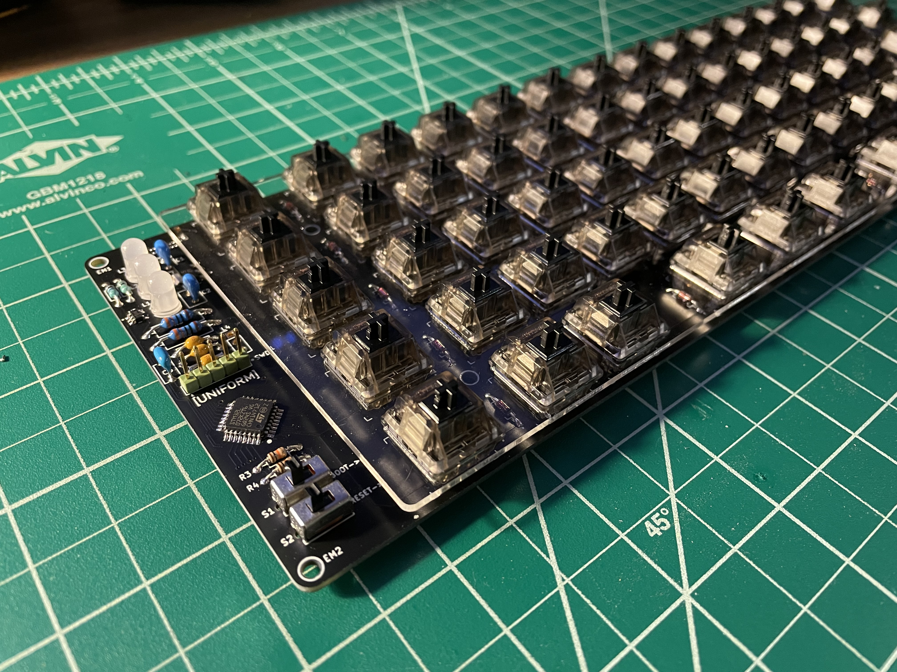
Total estimated time to completion: **3 hours** (**4.5 hours** with hot-swap)

### Main Components
Estimated time to completion: **1.5 hours**

---

1. Solder the **STM32L072KZT6** MCU component to the PCB at **U1**, taking care to align the dimpled corner on the chip with the white dot on the PCB.

This is the most difficult component to solder to the board, so take your time and ensure none of the pins are left bridged together. A little flux paste applied to the surface of the pads before soldering makes the solder flow much easier. 

I like to start by soldering a single pin from the MCU to the board. Then, while heating the pin with the soldering iron, I use tweasers to shift the MCU's position until its' feet are aligned with the rest of the pads on the board. Once heat is released from the pin, the chip is fixed in place. Apply the minimum amount of solder necessary to create a clean connection between the remaining pins and their pads.

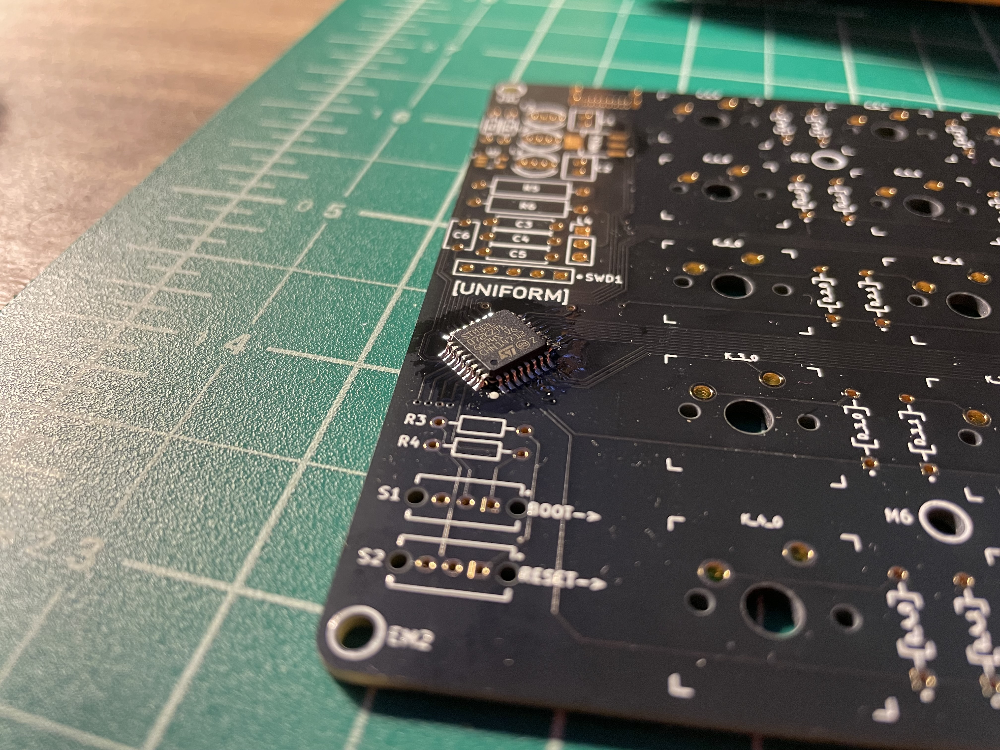

---

2. Solder the **SN74AHCT1G125DBVR** Logic Level Shifter to the PCB at **U2**.

---

3. Solder the **TLV1117-33IDCYG3** Voltage Regulator to the PCB at **VREG1**.

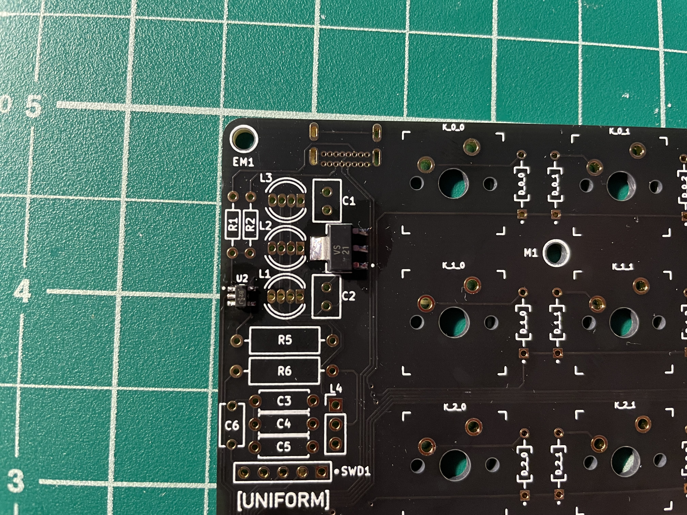

---

4. Solder the **USB4085-GF-A** USB-C Connector to the PCB at **USBC1**. Take care to not bridge any pin connections. Only the *bottom two fins* nearest the pins need to be soldered into the socket (as shown below). 

---

5. Solder the two **10 µF capacitors** to the PCB at **C1** and **C2**. These capacitors are not polarized, so they can be soldered in either orientation. 

It's easier to first seat the components flush to the board, then bend the legs to secure them in place *before* soldering.

Soldering through-hole components on the back side of the PCB is usually easier than soldering on the front. 

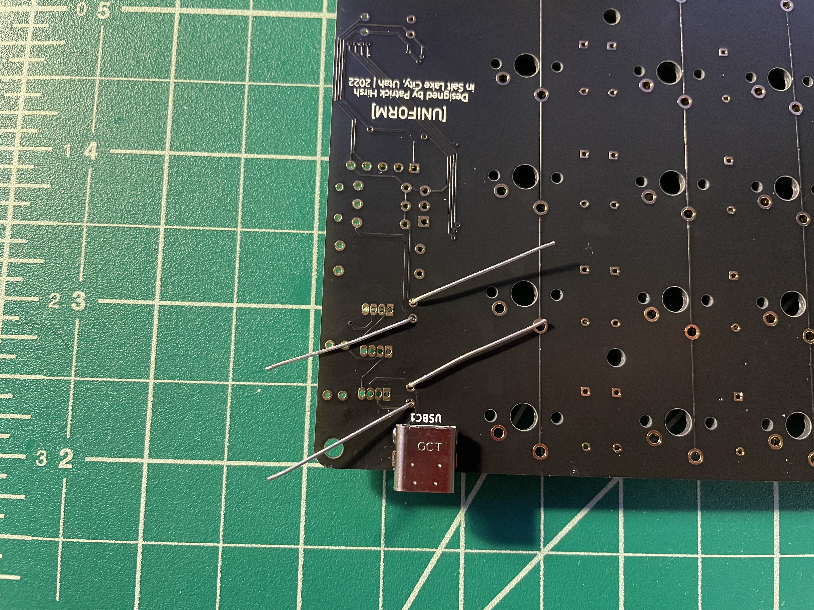 

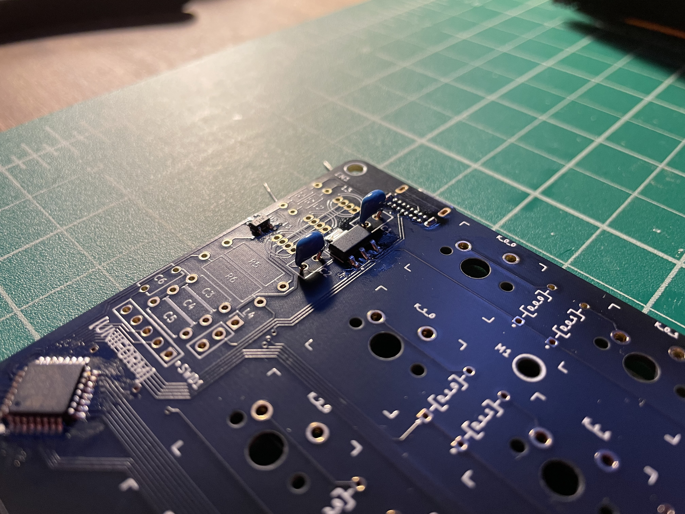

Once soldered, clip the excess wire.

---

6. Solder the single **1 µF capacitor** to the PCB at **C6**. This capacitor is not polarized, so it can be soldered in either orientation.

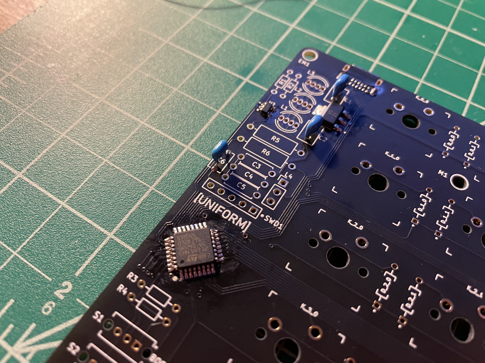

---

7. Solder the three **0.1 µF capacitors** to the PCB at **C3**, **C4**, and **C5**. These capacitors are not polarized, so they can be soldered in either orientation.

---

8. Solder the two **10 kOhm resistors** to the PCB at **R3** and **R4**. These resistors can be soldered in either orientation.

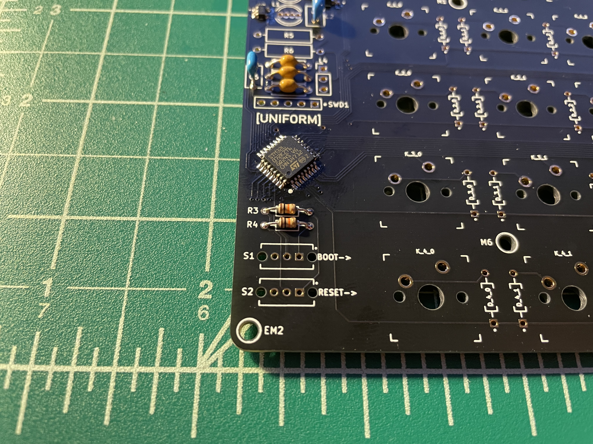

---

9. Solder the two **5.1 kOhm resistors** to the PCB at **R1** and **R2**. These resistors can be soldered in either orientation.

---

10. Solder the three **NeoPixel Status Leds** to the PCB at **L1**, **L2**, and **L3**. Orientation *does* matter. Take care to ensure the longer legs are seated on the right side of the footprint (the side with the rectangular pad).

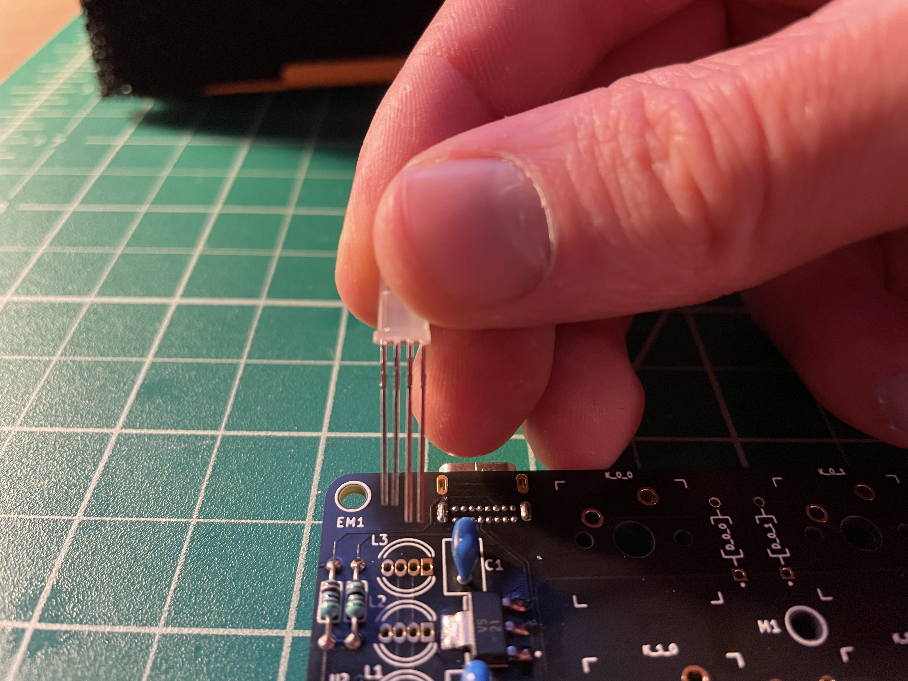

I like to start by only soldering one pin on each LED, that way I can heat the solder on one side and press the LED flush to the board with the other - ensuring it's seated right. Be extra careful when handling the top of the LED while heating its pins on the other side of the board. Don't burn yourself! 

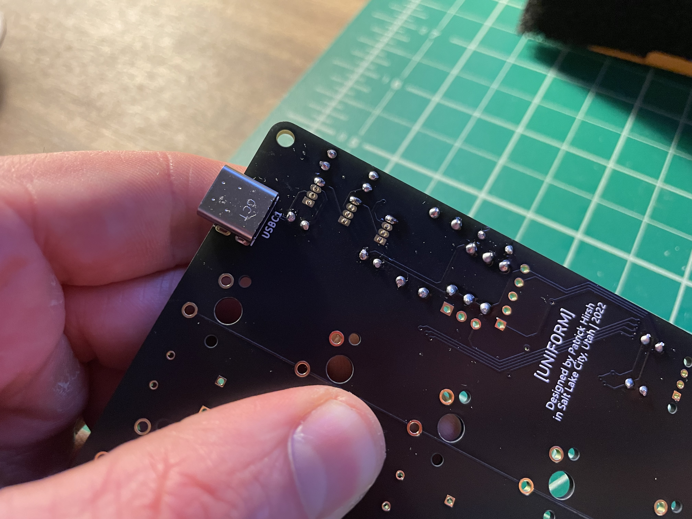

Once the first pin is soldered and you're happy with how the LED is seated, solder the other pins in place.

---

11. Next are the **330 Ohm resistors**. Soldering one into **R5** is *required*, and is used to smooth the data signal to the status LEDs. **R6** is *only necessary if you intend to use the external LED pinout* at **L4**; it's used to smooth L4's data line.

---

12. Solder the two **OS102011MS2QN1** Reset and Power switches into the PCB at **S1** and **S2**. 

I like to tape the switches into place while I solder the first pin, then heat the solder from the bottom while seating the switch into place by pressing it down from the top with my other hand (same technique as used with the status LEDs). The switches are metal and *will get very hot* while applying heat to the pins, so be careful when doing this:

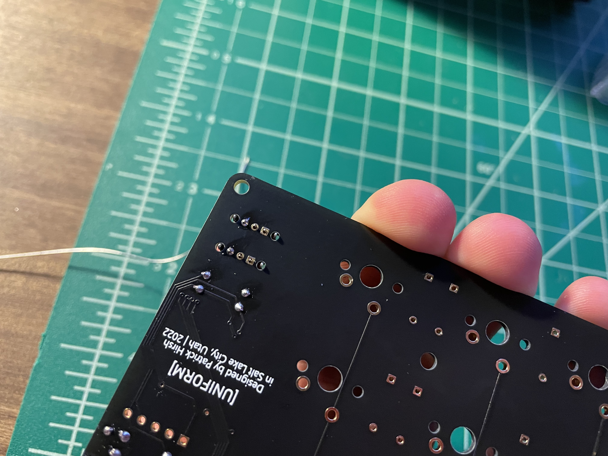

Once the switches are seated and aligned to your liking, solder the remaining pins to fix the switches in place. You do not need to apply solder to the outer pegs, only the inner 3 pins.

---

13. **(Optional)** If you've purchased the **826629-5** 5-pin header for SWD debugging, solder it to the PCB at **SWD1**. 

I used the same tape, single pin, heat and re-seat technique for this component as well. Take *extra care* here where handling the header while heating the pins as you'll be in contact with the *same metal pins that you're heating from the bottom*. Be sure not to touch the pin you're currently heating when reseating the header. 

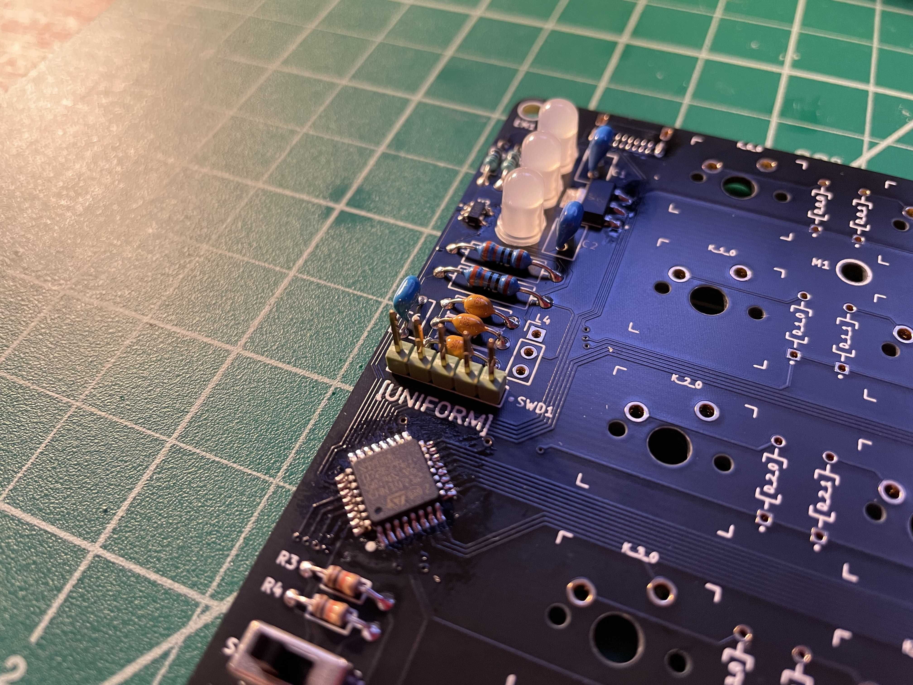

---

**We're Halfway There!**

If you've made it this far, nice work! Give yourself a pat on the back. We've just finished soldering all the main components. Your board should look something like this:

---

## Diodes
Estimated time to completion: **1.5 hours**

This part is a little tedious. We're going to be soldering all 68 **1N4148** diodes to their respective positions on the PCB - one per switch. 

You'll find their positions on the board adjacent to each switch, denoted **D_\<Row\>_\<Column\>**. Orientation **does matter**, so be sure that the diode is oriented such that current flows *down* from the switch to the row trace. on our 1N4148 diodes, this means the **black band on the diode should be on the *bottom***

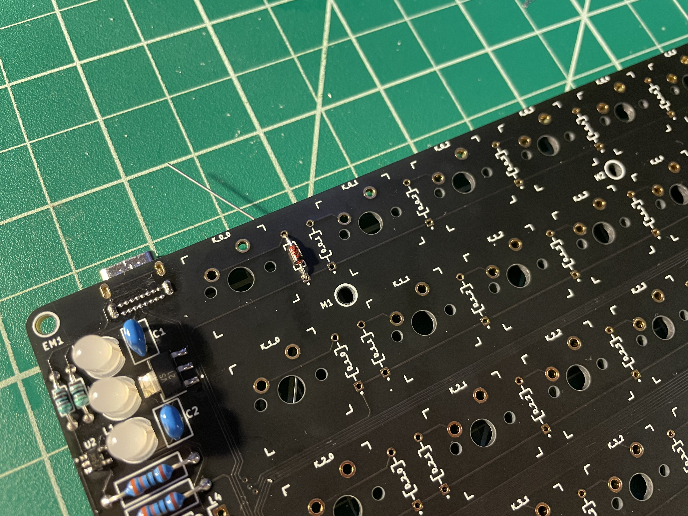

The most time consuming part of this whole step is bending and fiddling with the legs of the diodes to get them to fit centered in their footprint on the board. In my experience, the fastest way to do this is to find a flat tool that can be used to reliably bend the diodes in the same place every time. 

Here I'm using a pair of tweasers. I've found the point on the tool where the width causes the diode to bend at the right points, and I'm keeping my pointer finger here as I bend each diode so they all come out the same. This dramatically speeds up the process as all the diodes fit perfectly without too much fiddling.

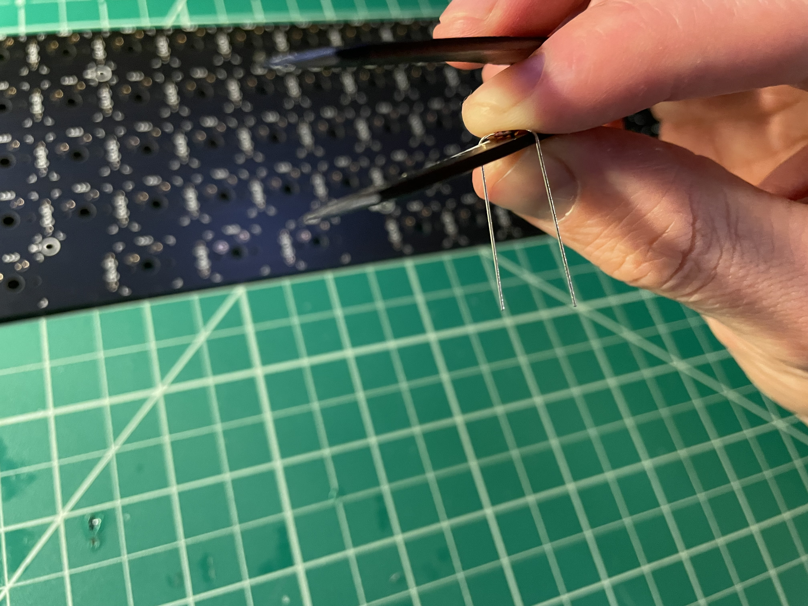

I like to pre-bend all the diodes first, then fit and secure them in place by bending their legs on the back of the PCB before doing any soldering.

*This is a good time to double-check that all the diodes are oriented the correct way!* 

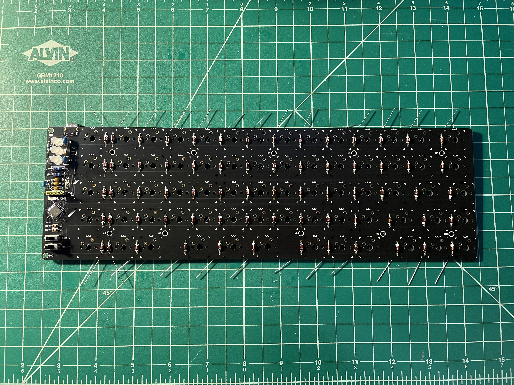
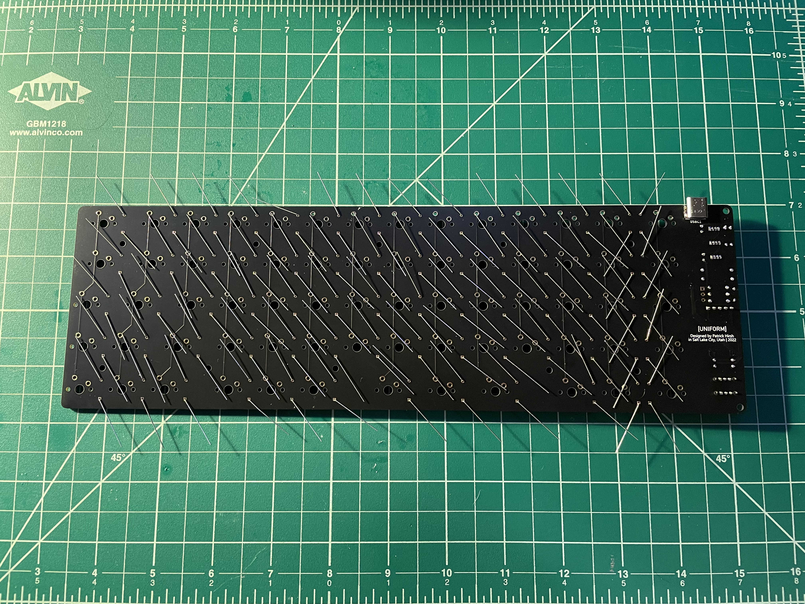

Finally, solder all the diodes in place and clip the excess wire. You should end up with something like this:

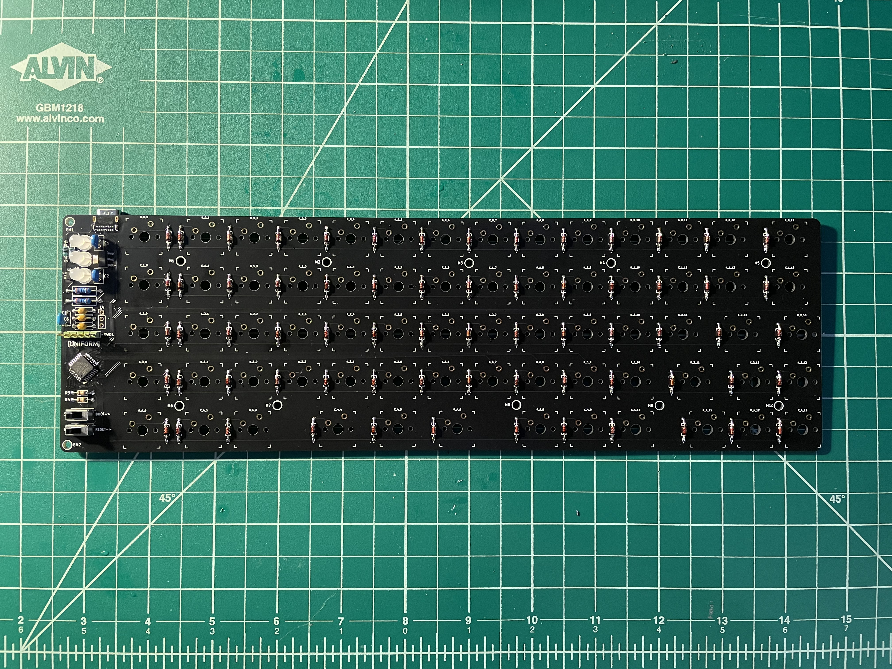

---

## Hot-Swap Sockets
**(Optional)**

Estimated time to completion: **1-2 hours**

If you've purchased hot-swap sockets, now's the time to solder them to the PCB. Installing these can be *really* tedious... and they're also quite expensive. In my opinion, though, it's well worth it for the ability to hot-swap switches. 

Personally, I like the **Mill-Max 7305** sockets best. The tips in this section really only apply to Mill-Max style hot-swap sockets, but plenty of guides exist for other hot-swap options.

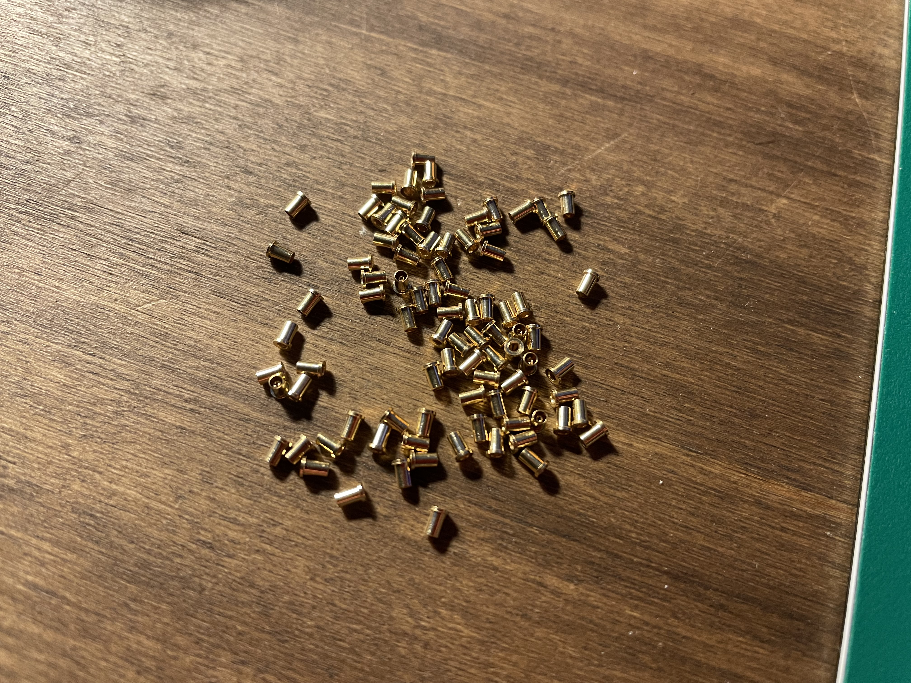

**Mill-Max 7305** sockets fit into the switch sockets (two per switch) with the ridge sitting on the top side of the PCB as shown below. This means you'll need to solder **136** sockets in total.

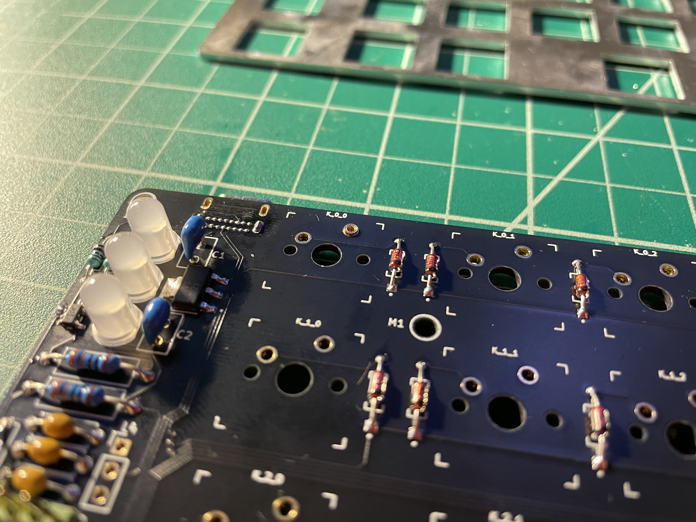

To ensure the sockets are aligned such that the switches aren't crooked when inserted, fit all the sockets *without* soldering first. Snap the switches through the plate and insert them into the hot-swap sockets. Make sure each switch socket contains a hotswap socket before inserting the switch.

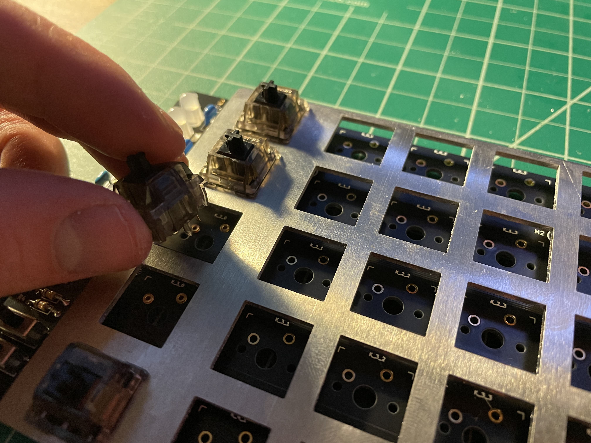

To save yourself from turning 1-2 hours of work into 3+ hours of anguish, *only insert a handful of sockets at a time and secure them in place with switches before inserting more*. This *does* mean you'll have to carefully insert the sockets with tweasers to reach between the swich plate, which *is* more difficult than putting them all in by hand first without the switch plate in the way, but *trust me*, it's far better this way. 

You'll inevitably pop a switch into the plate with a *little* too much force, and there's nothing more frustrating than watching all the sockets you carefully inserted into the switch sockets over the last hour pop out all at once. They're very light and tend to jump out of their sockets at even the slightest "pop". 

I can't tell you how many times I got greedy and had to re-learn this lesson...

Once all the sockets and switches have been inserted, carefuly flip the entire board over.

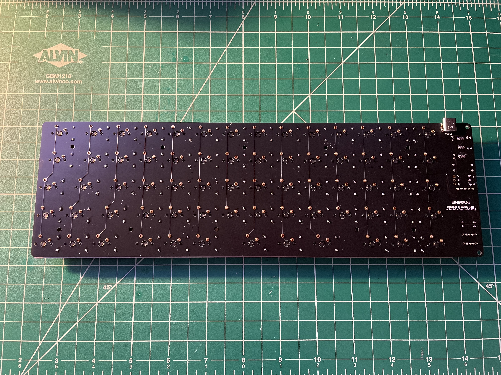

On the back of the PCB, the hot-swap sockets should protrude slightly. we'll be applying a small amount of solder to the outside of the socket wall, fixing the socket in place. 

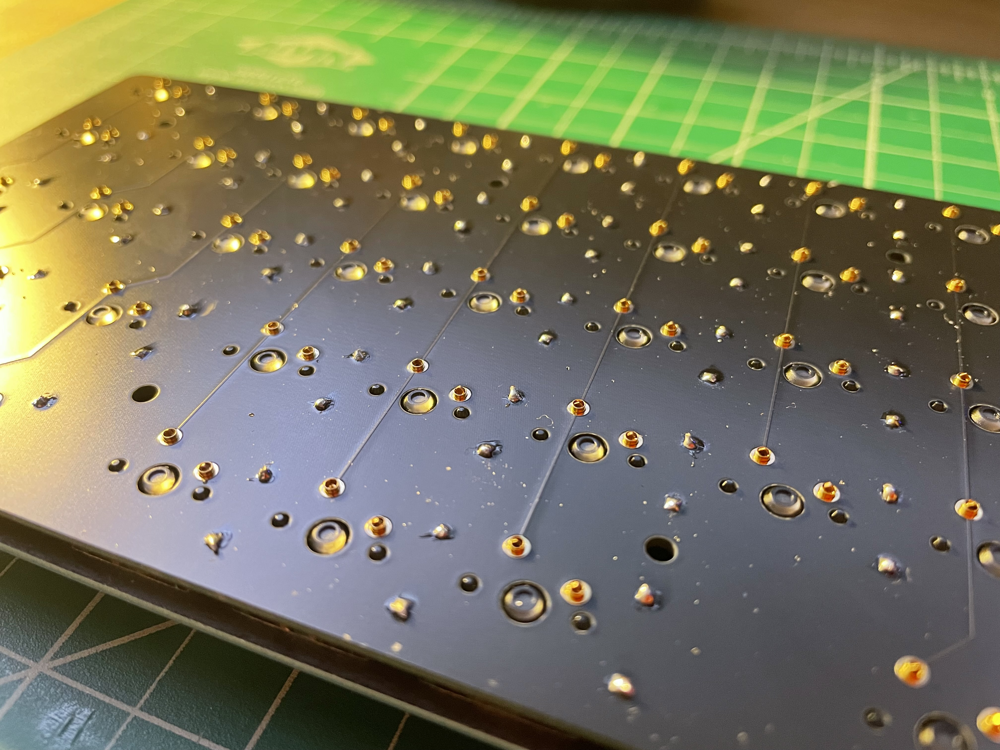

Apply slight pressure to the board as you solder each socket to ensure the socket and switch are sitting flush with the board as they're fixed in place. **Be careful not to get solder inside the socket!**

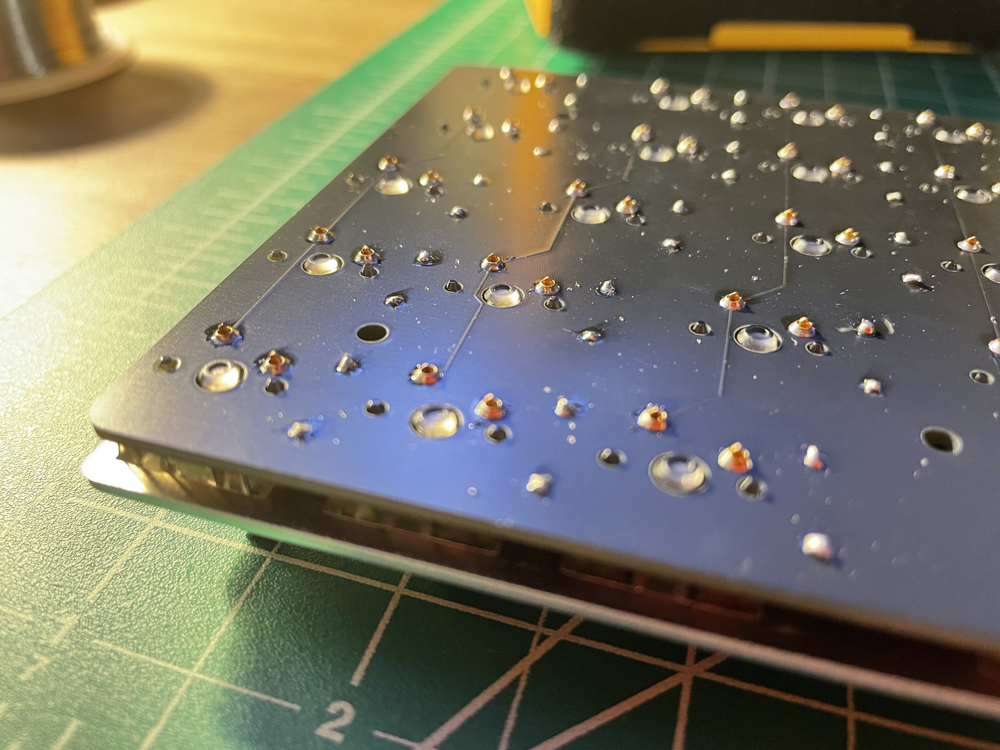

Once all the sockets have been soldered in place, you can pop the switches out to ensure none have been soldered into their sockets. 

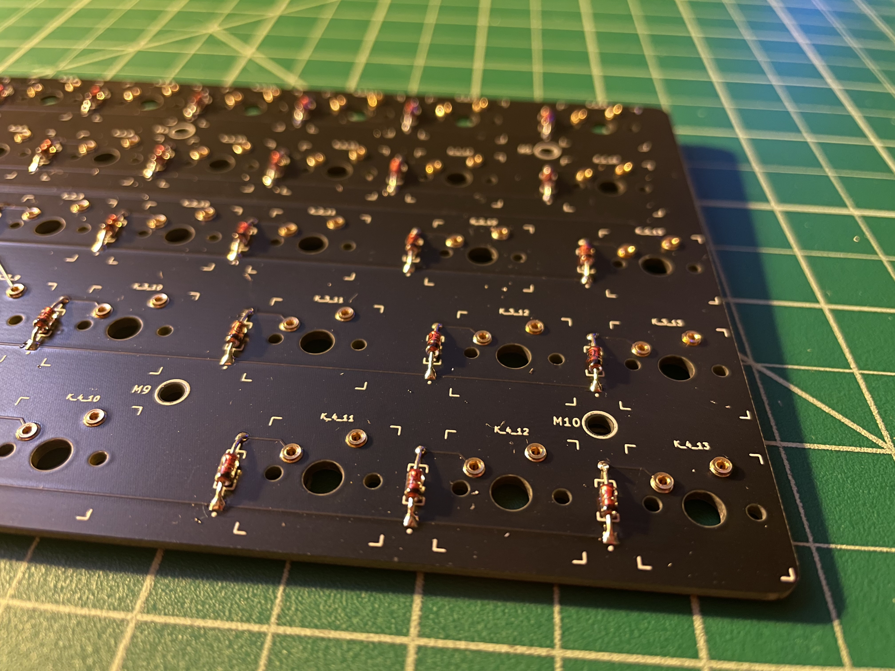

Patiently applying heat through a soldering wick is the best way to clean up a flooded socket if you've managed to get solder inside one. Eventually, you should be able to wiggle the switch free while applying heat to the pins.

---

## Switch and Plate
TODO ...

## Case Assembly and Mounting
TODO ...

# Flashing Firmware
TODO ...

